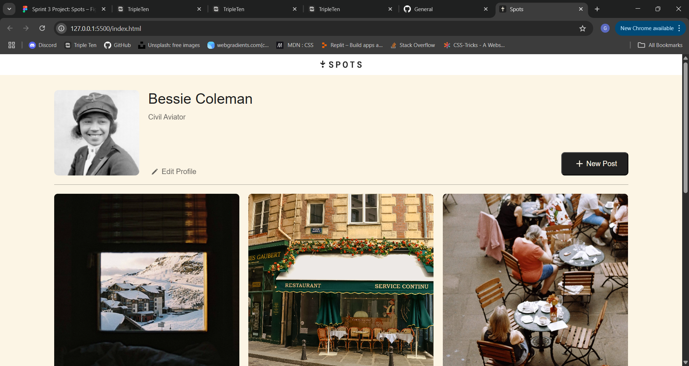
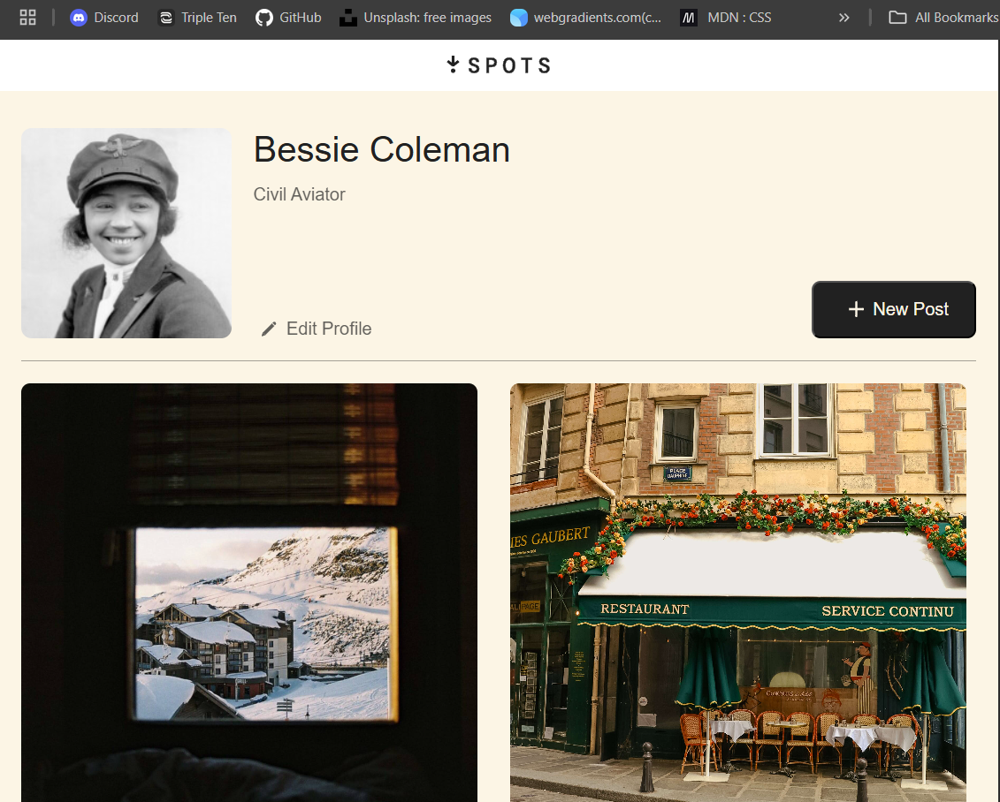
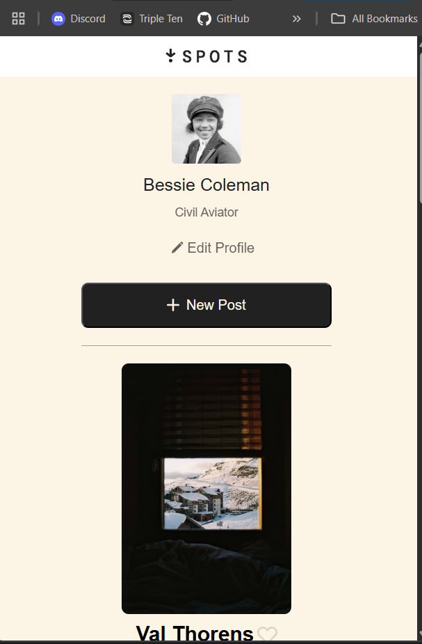

# Project 3: Spots

**Intro to Spots**

Spots is a social media site, built so that users can enjoy it on any screen size they choose. It allows for the user to upload pictures and give a brief description along with a heart button. The user is able to upload an image to represent themselves, give their name, and even a little info about themselves if they choose.

Grid as well as flex box was used for layout purposes to create an great experience on the site and ease of use. Media quieres were implemented in order for the site to be responsive allowing for multi device viewability.

### Key Features

- Responsive design (mobile, tablet, desktop)
- Photo upload capability
- User profile customization
- Interactive elements (heart button)
- Grid and Flexbox layout
- Cross-device compatibility

### Technologies

- HTML5
- CSS3 (Grid, Flexbox, Media Queries)
- BEM Methodology

## Screenshots

## GitHub pages link

https://GidBow.github.io/se_project_spots

## Video Link

https://1drv.ms/v/c/f55d112818180562/EV-4iiYvZl1HkrmCExgh8RUBzpwN7fYzhtz85lHO3kzcjg?e=Cge0co
